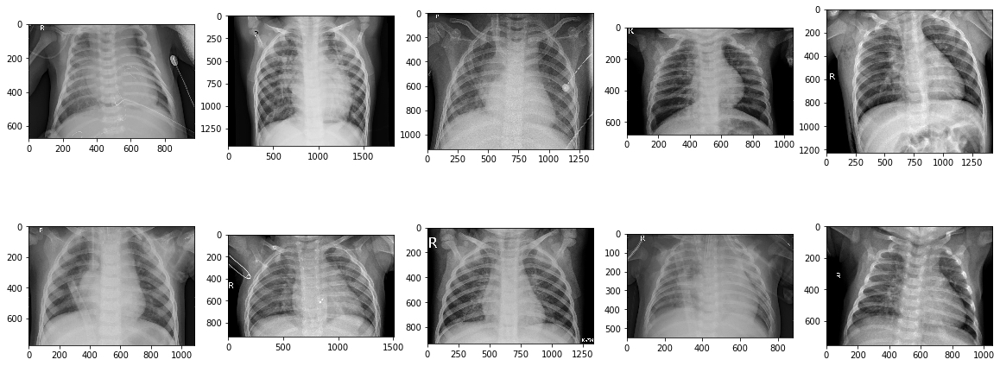
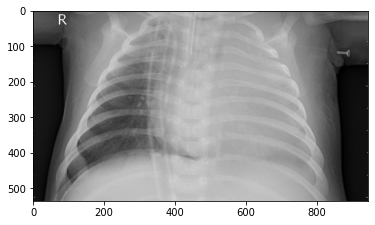
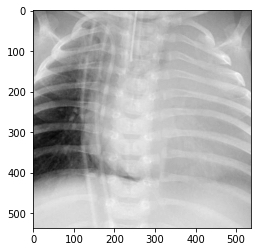
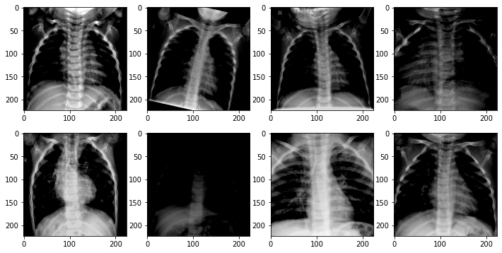
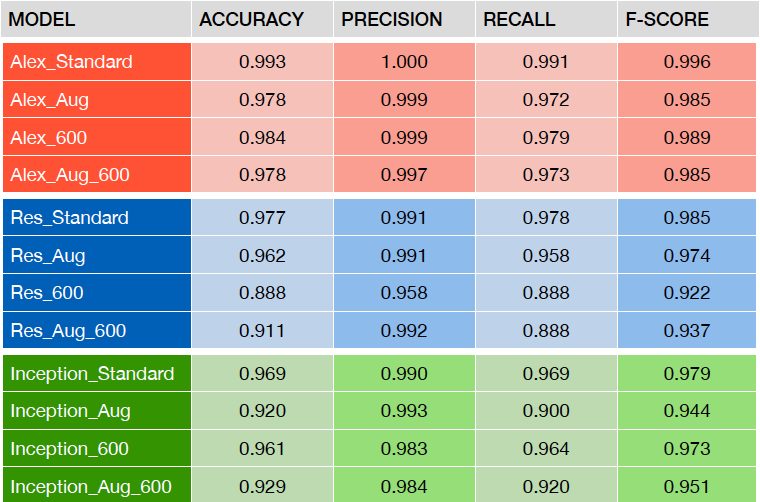
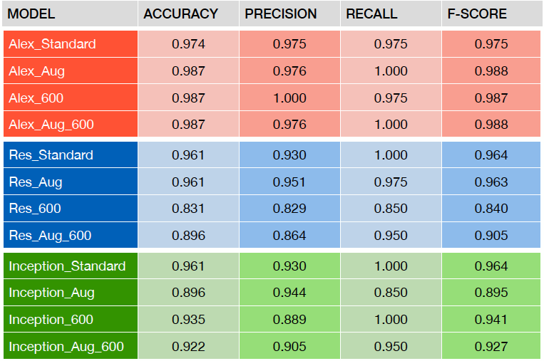
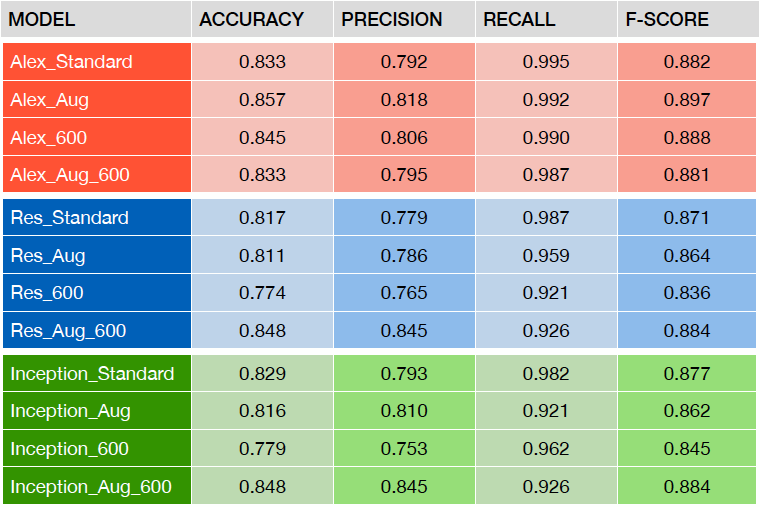
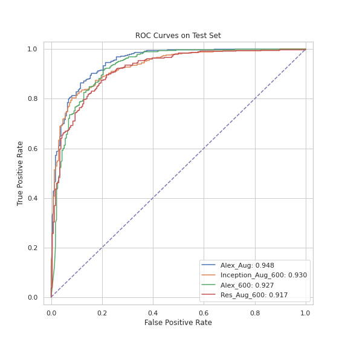

# Pneumonia Detection Through Chest X-Ray Images

NOTE: All notebooks were originally created on Google Colab in accordance with Google Drive's ecosystem, so the notebooks contain some special commands specific to Google Colab and the directories may not be applicable to this repo. 

**Date:** 04/23/2020

**Author:** Zexi Ye

## Overview

This project aims to develop a deep learning model that identifies whether a patient has developed pneumonia using his or her chest X-ray image.

### Dataset

The raw data can be found in this [Kaggle Dataset](https://www.kaggle.com/paultimothymooney/chest-xray-pneumonia). Essentially, the dataset consists of **5,856** chest X-ray images in total, including **4,273** positive records (meaning pneumonia is present) and **1,583** negative records (meaning no pneumonia). Data are split into **training**, **validation** and **testing** sets. All data are grayscale images of various dimensions.

Here is a brief introduction of the source and nature of the data.

<blockquote>
Chest X-ray images (anterior-posterior) were selected from retrospective cohorts of pediatric patients of one to five years old from Guangzhou Women and Children’s Medical Center, Guangzhou. All chest X-ray imaging was performed as part of patients’ routine clinical care.

For the analysis of chest x-ray images, all chest radiographs were initially screened for quality control by removing all low quality or unreadable scans. The diagnoses for the images were then graded by two expert physicians before being cleared for training the AI system. In order to account for any grading errors, the evaluation set was also checked by a third expert.
</blockquote>

Below, 10 randomly selected X-ray images in the presence of pneumonia are displayed.

### Notebooks

The project can be divided into three stages, each of which is documented extensively in its own notebook. The following are the names of the notebooks.

1. I - Preprocessing & Exploration
2. II - Training
3. III - Evaluation

## Preprocessing

### Expand the validation set

The original dataset contains 16 validation instances only, which is way too few to guide decisions during training (e.g. early stopping) in a reliable manner. Hence, we randomly picked 64 images (32 positives, 32 negatives) from the training set and moved them over to the validation set, expanding it to **80** images.

### CenterCrop

The raw images differ vastly in dimension and are usually in a rectangular form. Since most convolutional nets (CNN) are trained on and thus expect square-shaped input images, we convert all of the raw images into square-shaped images by cropping at the center. In doing so, we facilitate the training while preserving the most significant portion of the images. Note that no scaling is involved in this operation.

**Before CenterCrop**

**After CenterCrop**

## Training

### Models

We selected 3 popular open-source CNNs that are pre-trained on the renowned [ImageNet](http://image-net.org/index) dataset. Here is a list of the architectures with reference links to the paper.

- [AlexNet](https://arxiv.org/abs/1404.5997) - precursor of modern CNNs
- [ResNet-50](https://arxiv.org/abs/1512.03385) - skip connections
- [InceptionNet](https://arxiv.org/abs/1512.00567) v3 - inception blocks

For each model, we replace the classification block with our own classifier layers so that the models are in line with the desired task in this context. Specifically, we need to ensure that the network outputs a vector with a length of 2 as opposed to 1000, since only two classes exist (positive and negative) in this scenario.

The pre-trained weights are preserved and fine-tuned on our training data, which is known as *transfer learning*.

### Data manipulation

In order for raw images to be passed into neural networks, we are required to convert the data into tensors. This allows for latitude in manipulating the input. Thus, we decide to try different conversion schemes and examine the effect on the model's ability to generalize to unseen data. This includes modifying the resize factor as well as corrupting the input images through rotation, flipping, etc. (known as *data augmentation*).

Four schemes are used in converting the data.

1. **Standard:** downscale the training images to 224 by 224 (or 299 by 299 for InceptionNet)
2. **Augmented:** Scheme 1 + add random transformation to training images
3. **Large image:** instead of scaling down to 224 by 224 (or 299 by 299), we scale down the images to 600 by 600 in hopes of preserving finer details
4. **Augmented + large image:** combine Scheme 3 and Scheme 4

Here are a handful of images after data augmentation.

### Class imbalance

Note that a pronounced class imbalance in the training data towards the positive class (also in the test data, yet to a smaller extent), which is detrimental to training. To address the issue, we opt for a handy open-source PyTorch data sampler called [imbalaned-dataset-sampler](https://github.com/ufoym/imbalanced-dataset-sampler), which employs both over-sampling and under-sampling at the same time within each batch to attain class balance.

### Fine-tuning and early stopping

Therefore, we will have 12 resultant models and, for each configuration, we train for 10 epochs and save the weights after each epoch only if the validation loss drops in comparison to the current lowest loss.

For more details, please refer to the notebook: II - Training. 

## Evaluation & Analysis

After we finish training the models, we use them to make inference on the **training**, **validation** and **test** sets and derive insights from the result.

### Metrics

To assess our trained models, we will be examining the following metrics.

- Accuracy
- Precision
- Recall
- F-score
- ROC curves

Despite the fact that **accuracy** is a very intuitive metric that is simple to be understood by most people (both technical and non-technical), it is essential to beware of two major caveats in this context.

First, the datasets are severely **imbalanced**. In both the training and the testing datasets, positive observations outnumber negative observations by a substantial margin (3843 vs. 1312 in training set, 390 vs. 234 in testing set). Thus, we need to employ some base-rate invariant metrics (such as F-score) to obtain a more robust evaluation.

Second, the costs associated with **false positives** and **false negatives** differ immensely. Since we are operating in the medical field, a false negative would typically lead to far greater consequences than a false positive, in that the latter would cause some minor panic and potentially prompt a re-examination, while the former would lead to a lack of crucial treatment, allowing the patient's condition to deteriorate unchecked.

Therefore, we will evaluate the models in favor of metrics that are robust to class imbalance. Tables of metrics are displayed as follows.

#### Training set

#### Validation set

#### Test set (Important)

### Analysis

Per the tables above, we can reach a number of conclusions. Bear in mind that, due to class imbalance, we will primary focus on F-score, which combine both precision and recall quite favorably and is a more robust metric than accuracy under this circumstance.

1. On the test set, within each type of group, the highest F-score is achieved by a variant with at least some flavor of data manipulation. Namely, AlexNet with augmentation, ResNet with augmentation and 600 by 600 images, and InceptionNet with augmentation and 600 by 600 images. This implies that data augmentation and a larger input size are conducive to generalizability when employed wisely.

2. On the test set, metrics fall within a relatively narrow range among different architectures with slight variation. For instance, F-score varies over the range 0.83-0.90. Thus, it seems to follow that no model archicture presumbaly has an edge over other candidates. 

3. On the test set, recall always exceeds precision for a certain model, which is a desired property since we endeavor to identify as many positive cases as possible while a few false positives are tolerable. This signals that our models have behaved favorably on unseen data.

4. Note that, on the training set as well as on the validation set, the metrics are similar and fairly good. Nevertheless, we see a drastic decline on the test set. The plunge might suggest that either 1) the test set differs in some underlying concepts from the training/validation sets or 2) the test set contains errors in the labels. This skepticism is merely hypothetical, as it is hard to verify what contributes to the massive discrepancy in performance.

### ROC Curves

We plot the Receiver Operating Characteristics (ROC) curves of the predictions on the test set given by the top 4 models that achieve the highest test F-score.

Remarkably, here Alex_Aug is a clear winner, as its curve lies strictly above other contenders. Inception_Aug_600 and Alex_600 are neck to neck, as there are multiple crossovers along the way. Res_Aug_600, lastly, is not a strong competitor.